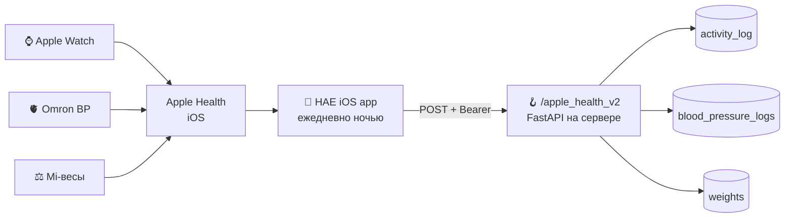
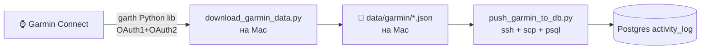

# Data Atlas Implementation Plan

> **For agentic workers:** REQUIRED SUB-SKILL: Use superpowers:subagent-driven-development (recommended) or superpowers:executing-plans to implement this plan task-by-task. Steps use checkbox (`- [ ]`) syntax for tracking.

**Goal:** Создать `docs/DATA_ATLAS.md` — один живой md-документ, отвечающий на «где у меня данные?» и «где у мульти-юзера дыры?» для 4 активных пользователей.

**Architecture:** Документ собирается итеративно по разделам, каждая итерация = один тематический срез данных (SQL, файлы, скрипты, cloud), один коммит. Никакого кода, кроме SQL-запросов и bash-команд для сбора. Минимум 3 архитектурных вывода в разделе Gaps & Risks.

**Tech Stack:** Markdown (Obsidian/GitHub flavor), Postgres SQL (через ssh + docker exec), bash, Python для парсинга `.env` если потребуется, Mermaid для pipeline diagrams.

**Сводка по спеке:** см. `docs/superpowers/specs/2026-05-17-data-atlas-design.md`.

**Worktree:** `~/.../Botkin/.claude/worktrees/charming-kirch-48016c/`, ветка `docs/data-atlas`.

---

## File Structure

- **Create:** `docs/DATA_ATLAS.md` — единственный итоговый артефакт
- **Read-only (источники):** `CLAUDE.md`, `~/.claude/CLAUDE.md`, `scripts/import/*.py`, `scripts/sync_all_data.sh`, `.env` (для понимания какие переменные есть), `database/models.py`, `telegram-bot/webhook/apple_health.py`
- **Sources с сервера:** `ssh root@116.203.213.137`, в основном `docker exec healthvault_postgres psql ...`

---

## Task 1: Скелет документа

**Files:**
- Create: `docs/DATA_ATLAS.md`

- [ ] **Step 1: Создать файл со скелетом**

Содержимое файла:

```markdown
# Data Atlas — Botkin

> **Что это:** карта данных проекта Botkin. Где живёт каждый поток, кто его обновляет, кто читает, кто из пользователей подключён.
> **Дата обновления:** 2026-05-17
> **Поддержка:** обновлять при изменениях архитектуры. Связанная спека: `docs/superpowers/specs/2026-05-17-data-atlas-design.md`.

## Содержание

1. [Executive Summary](#executive-summary)
2. [Главная таблица потоков](#главная-таблица-потоков)
3. [Physical Storage Map](#physical-storage-map)
4. [Pipeline Diagrams](#pipeline-diagrams)
5. [Gaps & Risks](#gaps--risks)
6. [Methodology](#methodology)

---

## Executive Summary

_Заполняется последним — после всех остальных разделов._

---

## Главная таблица потоков

| Поток | Источник | Транспорт | Хранится | Обновл. | Читают | Alex | Ника | Андрей | Олег |
|---|---|---|---|---|---|---|---|---|---|

_Будет заполнено в Task 2-7._

---

## Physical Storage Map

_Заполняется в Task 8._

---

## Pipeline Diagrams

_Заполняется в Task 9._

---

## Gaps & Risks

_Главная ценность аудита. Заполняется в Task 10 (после сбора всех данных)._

---

## Methodology

_Команды и SQL, которыми собирался атлас. Заполняется в Task 11._
```

- [ ] **Step 2: Verify скелет создан**

Run: `wc -l docs/DATA_ATLAS.md`
Expected: ~50 строк

- [ ] **Step 3: Commit**

```bash
git add docs/DATA_ATLAS.md
git commit -m "docs(atlas): скелет Data Atlas — оглавление и пустые разделы"
```

---

## Task 2: Inventory потоков из CLAUDE.md

**Files:**
- Read: `CLAUDE.md` (project), `~/.claude/CLAUDE.md` (user-level)
- Modify: `docs/DATA_ATLAS.md` (раздел «Главная таблица потоков»)

- [ ] **Step 1: Прочитать существующие inventory-таблицы**

```bash
grep -nE "^\|.*\|.*\|.*\|" CLAUDE.md | head -40
```

В `CLAUDE.md` уже есть таблица «Данные здоровья — источники и пайплайн» (около строк 38-78). Использовать её как стартовую точку.

- [ ] **Step 2: Заполнить таблицу первой колонкой — список потоков**

Минимальный список (16+ потоков) из CLAUDE.md:

```
1. Питание
2. Добавки / витамины
3. Вес / композиция тела
4. Давление крови (Omron)
5. Шаги (Apple Health)
6. Шаги (Garmin) — отдельный поток или совмещён?
7. Пульс покоя
8. HRV
9. Сон
10. Стресс
11. Body Battery
12. Тренировки / активности (Garmin)
13. Походка (gait — speed, step length, double support, asymmetry)
14. Воздух дома (Netatmo)
15. Погода (Open-Meteo)
16. iPhone Screen Time (ActivityWatch + Biome)
17. Mac Screen Time (ActivityWatch)
18. Медицинские документы (knowledge_base.json)
```

Записать каждую строку в таблицу. Колонки «Источник» / «Транспорт» / «Хранится» заполняются как `?` или из CLAUDE.md если очевидно.

- [ ] **Step 3: Verify таблица содержит 16+ строк**

Run: `grep -c "^| [А-Я0-9]" docs/DATA_ATLAS.md`
Expected: ≥16

- [ ] **Step 4: Commit**

```bash
git add docs/DATA_ATLAS.md
git commit -m "docs(atlas): inventory 18 потоков из CLAUDE.md"
```

---

## Task 3: Заполнить колонку «Хранится» через Postgres SQL

**Files:**
- Read: server Postgres (ssh + docker exec)
- Modify: `docs/DATA_ATLAS.md` (таблица)

- [ ] **Step 1: Получить список таблиц на сервере**

```bash
ssh root@116.203.213.137 'docker exec healthvault_postgres psql -U healthvault -d healthvault -c "\dt"'
```

Expected: вывод вида `nutrition_log | supplements_log | weights | activity_log | blood_pressure_logs | sleep_records | workouts | users | user_settings | biomarkers | ...`

- [ ] **Step 2: Для каждой таблицы — счётчики и per-user breakdown**

Запустить для **каждой** значимой таблицы:

```bash
ssh root@116.203.213.137 "docker exec healthvault_postgres psql -U healthvault -d healthvault -c \"
SELECT '<table_name>' AS tbl,
       COUNT(*) AS rows,
       MIN(<date_col>)::date AS first_date,
       MAX(<date_col>)::date AS last_date,
       COUNT(DISTINCT user_id) AS users
FROM <table_name>;\""
```

Список таблиц для опроса: `nutrition_log`, `supplements_log`, `weights`, `activity_log`, `blood_pressure_logs`, `sleep_records`, `workouts`, `biomarkers`.

**Внимание:** имя date-колонки разное в разных таблицах. `weights.measured_at` vs `nutrition_log.date`. Сначала через `\d <table>` посмотреть схему, потом запрос.

- [ ] **Step 3: Per-user counts для проверки кто чем пользуется**

```bash
ssh root@116.203.213.137 "docker exec healthvault_postgres psql -U healthvault -d healthvault -c \"
SELECT u.first_name, t.tbl, t.n FROM (
  SELECT user_id, 'nutrition' AS tbl, COUNT(*) AS n FROM nutrition_log GROUP BY user_id
  UNION ALL
  SELECT user_id, 'supplements', COUNT(*) FROM supplements_log GROUP BY user_id
  UNION ALL
  SELECT user_id, 'activity', COUNT(*) FROM activity_log GROUP BY user_id
  UNION ALL
  SELECT user_id, 'weights', COUNT(*) FROM weights GROUP BY user_id
  UNION ALL
  SELECT user_id, 'bp', COUNT(*) FROM blood_pressure_logs GROUP BY user_id
) t JOIN users u ON u.telegram_id = t.user_id
ORDER BY u.first_name, t.tbl;\""
```

- [ ] **Step 4: Заполнить в таблице атласа**

Для каждой строки:
- Колонка «Хранится» — `Postgres.<table>` или `файл на Mac` (для Garmin сырых данных)
- Колонки Alex/Ника/Андрей/Олег — `✅` если count > 0, `⚠️` если есть в БД но мало (<30 записей), `—` если 0

- [ ] **Step 5: Commit**

```bash
git add docs/DATA_ATLAS.md
git commit -m "docs(atlas): заполнить Postgres-колонки + per-user статус через SQL-аудит"
```

---

## Task 4: File scan локального хранилища (Mac, data/)

**Files:**
- Read: `data/*/` (локальные файлы Botkin)
- Modify: `docs/DATA_ATLAS.md`

- [ ] **Step 1: Inventory локальных папок и размеров**

```bash
cd "/Users/alexlyskovsky/Library/CloudStorage/GoogleDrive-lyskovsky@gmail.com/Мой диск/Projects/Vibe coding/Botkin"
du -sh data/*/ 2>/dev/null | sort -h
```

Expected: список папок типа `data/garmin/`, `data/weather/`, `data/environment/`, `data/apple_health/`, `data/activities/`, `data/cache/`, `data/nutrition/` и т.д.

- [ ] **Step 2: Для каждой папки — последний файл и его дата**

```bash
for d in data/*/; do
  echo "=== $d ==="
  ls -lt "$d" 2>/dev/null | head -3
done
```

- [ ] **Step 3: FamilyHealth (Google Drive) inventory**

```bash
ls -la "/Users/alexlyskovsky/Library/CloudStorage/GoogleDrive-lyskovsky@gmail.com/Мой диск/FamilyHealth/" 2>/dev/null
```

Expected: 4-5 папок «{Имя} — Здоровье», в каждой `knowledge_base.json` + папки с PDF.

- [ ] **Step 4: Обновить колонки «Хранится» и «Обновл.»**

Уточнить в таблице:
- Garmin raw — `data/garmin/daily-summary/YYYY-MM-DD.json` (на Mac) + `activity_log` (Postgres)
- Knowledge Base — `~/FamilyHealth/{Имя} — Здоровье/knowledge_base.json` + `biomarkers` table (Postgres, если есть)
- Apple Health flat — `data/apple_health_*.json` на Mac
- Netatmo — `data/environment/netatmo_history.json`

- [ ] **Step 5: Commit**

```bash
git add docs/DATA_ATLAS.md
git commit -m "docs(atlas): добавить локальные файлы Mac + Google Drive FamilyHealth в storage map"
```

---

## Task 5: Code trace — какой скрипт что делает

**Files:**
- Read: `scripts/import/*.py`, `scripts/sync_all_data.sh`, `scripts/push_garmin_to_db.py`, `telegram-bot/webhook/apple_health.py`
- Modify: `docs/DATA_ATLAS.md` (колонки «Источник», «Транспорт»)

- [ ] **Step 1: Полный список import-скриптов**

```bash
ls -la scripts/import/ scripts/push_garmin_to_db.py 2>/dev/null
```

- [ ] **Step 2: Для каждого скрипта определить input/output**

Прочитать docstring или первые 30 строк каждого. Заполнить mental map:

| Скрипт | Читает | Пишет |
|---|---|---|
| `garmin/download_garmin_data.py` | Garmin API (per user) | `data/garmin/*.json` |
| `push_garmin_to_db.py` | `data/garmin/*.json` | Postgres `activity_log` (через SSH) |
| `import/zepp_api.py` | Zepp API (через SSH-прокси, CN3) | `data/zepp_export_latest.csv` |
| `import/netatmo.py` | Netatmo API | `data/environment/netatmo_history.json` |
| `import/weather.py` | Open-Meteo API | `data/weather/weather_history.json` |
| `import/activitywatch.py` | ActivityWatch local API | `data/activities/iphone_screentime_perapp.json` |
| `import/mac_screentime.py` | ActivityWatch + knowledgeC.db | `data/activities/mac_screentime_perapp.json` |
| `import/parse_apple_health_xml.py` | `/tmp/apple_health/.../export.xml` | `data/apple_health_*.json` |
| `webhook/apple_health.py` | HTTP POST от HAE iOS app | Postgres `activity_log`, `blood_pressure_logs`, `weights` |

- [ ] **Step 3: Обновить таблицу в атласе**

В колонках «Источник» / «Транспорт» теперь конкретные имена устройств и скриптов, а не `?`.

- [ ] **Step 4: Commit**

```bash
git add docs/DATA_ATLAS.md
git commit -m "docs(atlas): code trace — заполнить колонки источник/транспорт по import-скриптам"
```

---

## Task 6: Per-user config audit

**Files:**
- Read: server Postgres `users` table, `.env` на проде
- Modify: `docs/DATA_ATLAS.md`

- [ ] **Step 1: Полная схема таблицы users**

```bash
ssh root@116.203.213.137 'docker exec healthvault_postgres psql -U healthvault -d healthvault -c "\d users"'
```

Цель: понять какие per-user креды/настройки хранятся (например, `garmin_email`, `health_token`, `share_token`, `apple_health_token`).

- [ ] **Step 2: Кто из юзеров имеет какие токены**

```bash
ssh root@116.203.213.137 "docker exec healthvault_postgres psql -U healthvault -d healthvault -c \"
SELECT first_name,
       (garmin_email IS NOT NULL) AS has_garmin,
       (share_token IS NOT NULL) AS has_share,
       (health_token IS NOT NULL) AS has_mcp,
       last_active::date
FROM users
WHERE is_active = true
ORDER BY telegram_id;\""
```

- [ ] **Step 3: Per-user токены в .env (если хардкод)**

```bash
ssh root@116.203.213.137 'grep -vE "^#|^$" /opt/healthvault/.env | grep -iE "user|alex|nika|andrey|oleg|alexander" | sed "s/=.*/=<REDACTED>/"'
```

Ожидаемая находка: что-то типа `APPLE_HEALTH_TOKEN=` — глобальный или per-user?

- [ ] **Step 4: Обновить колонки Alex/Ника/Андрей/Олег**

Уточнить из агрегата:
- ✅ — поток работает (есть данные + есть needed creds для автосинка)
- ⚠️ — частично (данные есть, но нет автосинка / есть creds, но мало данных)
- — — поток для юзера не настроен

- [ ] **Step 5: Commit**

```bash
git add docs/DATA_ATLAS.md
git commit -m "docs(atlas): per-user audit — токены, активность, кто чем реально пользуется"
```

---

## Task 7: External cloud audit — что мы пуллим из внешних сервисов

**Files:**
- Read: `.env` (имена кредов), `data/cache/tokens.json` (если есть)
- Modify: `docs/DATA_ATLAS.md`

- [ ] **Step 1: Inventory внешних сервисов из .env**

```bash
cd "/Users/alexlyskovsky/Library/CloudStorage/GoogleDrive-lyskovsky@gmail.com/Мой диск/Projects/Vibe coding/Botkin"
grep -vE "^#|^$" .env | sed "s/=.*//" | sort -u
```

Expected categories: API keys (OpenAI/Gemini/Anthropic), Garmin, Zepp, Netatmo, Apple Health token, Postgres, Sleepcycle.

- [ ] **Step 2: Состояние OAuth-токенов**

```bash
ls -la data/cache/tokens.json data/cache/ 2>/dev/null
cat data/cache/tokens.json 2>/dev/null | python3 -c "
import json, sys
d = json.load(sys.stdin)
for k, v in d.items():
    if isinstance(v, dict):
        print(f'{k}: expires_at={v.get(\"expires_at\", \"?\")}, keys={list(v.keys())[:5]}')
"
```

Expected: Zepp token, Netatmo refresh, и т.д. — кто живой, кто протух.

- [ ] **Step 3: Дописать в таблицу/storage map**

В колонке «Транспорт» уточнить «через какое API»:
- Garmin → `garth` Python library (OAuth1 + OAuth2)
- Zepp → `https://api-mifit-cn3.zepp.com` через SSH-прокси
- Netatmo → official API, refresh_token в .env
- Apple Health → HAE webhook (Bearer token = `APPLE_HEALTH_TOKEN`)
- Open-Meteo → no auth

- [ ] **Step 4: Commit**

```bash
git add docs/DATA_ATLAS.md
git commit -m "docs(atlas): external cloud audit — какие API, какие токены, кто живой"
```

---

## Task 8: Physical Storage Map — отдельный раздел

**Files:**
- Modify: `docs/DATA_ATLAS.md` (раздел «Physical Storage Map»)

- [ ] **Step 1: Написать раздел по локациям**

Структура:

```markdown
## Physical Storage Map

### Mac (`~/.../Botkin/data/`)

| Папка | Размер | Что | Источник | Кто пишет |
|---|---|---|---|---|
| `data/garmin/daily-summary/` | NN MB | дневные JSON 2025-2026 | Garmin API | `download_garmin_data.py` |
| `data/apple_health_*.json` | NN MB | плоские агрегаты | XML экспорт | `parse_apple_health_xml.py` |
| ... | | | | |

**Итого на Mac:** ~N GB.

### Hetzner Postgres (`/opt/healthvault`, БД `healthvault`)

| Таблица | Строк | Размер | Описание |
|---|---|---|---|
| `nutrition_log` | N | KB | приёмы пищи |
| `activity_log` | N | KB | дневные агрегаты Apple Health |
| ... | | | |

### Google Drive (`~/FamilyHealth/`)

| Папка | Содержимое |
|---|---|
| `Александр — Здоровье/` | PDFs анализов, knowledge_base.json |
| `Ника — Здоровье/` | то же для Ники |
| ... | |

### Внешние сервисы (через API, без локального персистентного хранилища)

- **Garmin Connect** — тянем raw JSON в `data/garmin/`, потом пишем в Postgres
- **Apple Health (через HAE app)** — proxy, не хранит сам
- **Zepp Cloud** — тянем CSV в `data/zepp_export_latest.csv`
- **Netatmo Cloud** — тянем в `data/environment/netatmo_history.json`
- **Open-Meteo** — тянем в `data/weather/weather_history.json`
```

Заполнить реальными цифрами из Tasks 3, 4.

- [ ] **Step 2: Commit**

```bash
git add docs/DATA_ATLAS.md
git commit -m "docs(atlas): Physical Storage Map — 4 локации с цифрами"
```

---

## Task 9: Pipeline diagrams (3 mermaid)

**Files:**
- Modify: `docs/DATA_ATLAS.md` (раздел «Pipeline Diagrams»)

- [ ] **Step 1: Apple Health pipeline**

Вставить в раздел:

````markdown
### 1. Apple Health → Postgres


````

- [ ] **Step 2: Knowledge Base pipeline**

````markdown
### 2. Медицинские документы → Knowledge Base

```mermaid
flowchart LR
    PDF[📄 PDF анализов / УЗИ / заключения<br>📂 ~/FamilyHealth/{Имя}/]
    PDF -->|Claude читает вручную| EX[📝 Извлечение биомаркеров]
    EX -->|обновляет JSON| KB[(knowledge_base.json<br>в той же папке)]
    KB -->|admin import-script| BIO[(Postgres biomarkers)]
    BIO --> DSH[📈 Dashboard]
    KB -.планируется.-> MCP[🔌 MCP server]
```
````

- [ ] **Step 3: Garmin pipeline**

````markdown
### 3. Garmin → Postgres


````

- [ ] **Step 4: Verify mermaid рендерится**

Открыть в GitHub preview или в Cursor с Markdown Preview extension. Каждая диаграмма должна рендериться без ошибок.

- [ ] **Step 5: Commit**

```bash
git add docs/DATA_ATLAS.md
git commit -m "docs(atlas): 3 pipeline diagrams — Apple Health, Knowledge Base, Garmin"
```

---

## Task 10: Gaps & Risks — главный раздел

**Files:**
- Modify: `docs/DATA_ATLAS.md` (раздел «Gaps & Risks»)

- [ ] **Step 1: Синтез наблюдений из всех предыдущих tasks**

Перечитать заполненную таблицу + storage map. Искать паттерны:

1. **Где single point of failure?** — что лежит ТОЛЬКО на Mac (если Mac сломается, какие потоки теряются)
2. **Где данные дублируются?** — один поток в двух местах (Mac + сервер, или 2 разные таблицы)
3. **Где multi-user не работает?** — поток ✅ только для Alex, для остальных —
4. **Что обновляется руками?** — не автомат, требует моего присутствия
5. **Где разрыв pipeline?** — данные пишутся в один формат, читаются из другого

- [ ] **Step 2: Сформулировать минимум 3 архитектурных вывода**

Каждый вывод по шаблону:

```markdown
### Risk N: <Короткое имя>

**Что:** <одно предложение, какая проблема>
**Симптомы:** <как проявляется>
**Что не работает / чем угрожает:** <последствия>
**Возможные решения:** <2-3 направления, без выбора пока>
```

Примеры тематик (нужно подтвердить на реальных данных):
- Mac как single point of failure для Garmin / Apple Health flat / weather / Netatmo (`sync_all_data.sh` бегает на Mac)
- Knowledge Base существует в двух копиях (Google Drive JSON + Postgres biomarkers) — расходятся
- Ника / Андрей / Олег не имеют Garmin = пробел в HRV для всех кроме Alex
- Apple Health токен один на всех (`APPLE_HEALTH_TOKEN`) — не per-user, не работает мульти-юзер
- Подача в Knowledge Base ручная (Claude + я) — не масштабируется

- [ ] **Step 3: Verify ≥3 выводов написано**

Run: `grep -c "^### Risk" docs/DATA_ATLAS.md`
Expected: ≥3

- [ ] **Step 4: Commit**

```bash
git add docs/DATA_ATLAS.md
git commit -m "docs(atlas): Gaps & Risks — главный синтез аудита (≥3 архитектурных вывода)"
```

---

## Task 11: Executive Summary + Methodology

**Files:**
- Modify: `docs/DATA_ATLAS.md` (разделы «Executive Summary», «Methodology»)

- [ ] **Step 1: Executive Summary**

Написать **5-7 предложений** в начале:

Шаблон:
- 1-е предложение: общая статистика (N потоков, M пользователей, K локаций хранения)
- 2-е: главный архитектурный паттерн (single Postgres + Mac-сторонние интеграции + Google Drive для медданных)
- 3-4-е: 2-3 главных красных флага из раздела Gaps & Risks (одной строкой каждый)
- 5-6-е: что работает хорошо (где сильные стороны)
- 7-е: следующий рекомендуемый шаг (со ссылкой на будущую спеку миграции)

- [ ] **Step 2: Methodology**

Написать раздел-приложение, чтобы атлас можно было обновить:

```markdown
## Methodology

Атлас собирался следующими командами (для будущих обновлений):

### SQL аудит таблиц
\`\`\`bash
ssh root@116.203.213.137 'docker exec healthvault_postgres psql -U healthvault -d healthvault -c "\dt"'
ssh root@116.203.213.137 'docker exec healthvault_postgres psql -U healthvault -d healthvault -c "<per-table count query>"'
\`\`\`

### File scan локально
\`\`\`bash
du -sh data/*/
ls -lt data/garmin/daily-summary/ | head -5
\`\`\`

### Code trace
\`\`\`bash
ls scripts/import/ scripts/push_garmin_to_db.py
head -30 <каждый скрипт>
\`\`\`

### Per-user config
\`\`\`bash
ssh root@116.203.213.137 'docker exec healthvault_postgres psql -U healthvault -d healthvault -c "SELECT first_name, garmin_email IS NOT NULL, share_token IS NOT NULL, health_token IS NOT NULL FROM users WHERE is_active = true;"'
\`\`\`

### Когда обновлять
- Добавили новый поток данных
- Поменяли где что хранится (новая таблица, новый файл)
- Подключили нового пользователя
- Изменили транспорт (например, поменяли API одного из устройств)
- Изменили scope мульти-юзера
```

- [ ] **Step 3: Commit**

```bash
git add docs/DATA_ATLAS.md
git commit -m "docs(atlas): Executive Summary (7 предложений) + Methodology для повторных обновлений"
```

---

## Task 12: Self-review + push + PR

**Files:**
- Read: `docs/DATA_ATLAS.md` целиком

- [ ] **Step 1: Прочитать атлас от и до**

Чек-лист (из спеки `docs/superpowers/specs/2026-05-17-data-atlas-design.md`):

- [ ] Главная таблица — все 16+ строк заполнены, нет `?` в колонках
- [ ] Все 4 пользователя имеют ✅ / ⚠️ / — в каждой строке (никаких пустых ячеек)
- [ ] Physical Storage Map — 4 локации (Mac / Hetzner Postgres / Google Drive / External cloud) с реальными цифрами
- [ ] Минимум 3 risk в Gaps & Risks
- [ ] Все 3 mermaid рендерятся
- [ ] Executive Summary ≤7 предложений
- [ ] Methodology содержит все команды, которыми можно повторить аудит

- [ ] **Step 2: Push ветку**

```bash
git push -u origin docs/data-atlas
```

- [ ] **Step 3: Открыть PR в main**

```bash
gh pr create --repo Lyskovsky/Botkin --base main --head docs/data-atlas \
  --title "docs: Data Atlas — первый аудит «где у меня данные»" \
  --body "$(cat <<'EOF'
## Что

`docs/DATA_ATLAS.md` — карта данных проекта Botkin. Stream-first таблица для 4 активных пользователей, Physical Storage Map, 3 pipeline diagrams, Gaps & Risks (главная ценность), Methodology.

## Зачем

Первый шаг архитектурного брейнсторма (Granola «Botkin 16.05»): прежде чем мигрировать на server-side sync / NanoCloud / MCP-сервер — нужна честная карта того что есть сейчас.

## Спека

`docs/superpowers/specs/2026-05-17-data-atlas-design.md`

## Что дальше

Раздел **Gaps & Risks** — вход для следующих спек:
- server-side sync (вынести с Mac)
- Knowledge Base синхронизация
- per-user authentication для Apple Health / Garmin
EOF
)"
```

- [ ] **Step 4: Отчитаться юзеру**

Завершить сообщением: ссылка на PR + краткая выжимка главных Gap'ов из раздела Gaps & Risks (1 предложение на каждый риск).

---

## Self-review (writing-plans skill chek)

1. **Spec coverage:**
   - ✅ Главная таблица — Task 2-7
   - ✅ 4 колонки пользователей — Task 3, 6
   - ✅ Physical Storage Map — Task 4, 8
   - ✅ Pipeline diagrams — Task 9
   - ✅ Gaps & Risks ≥3 — Task 10
   - ✅ Executive Summary ≤7 предл. — Task 11
   - ✅ Methodology — Task 11

2. **Placeholder scan:** Нет «TBD/TODO/fill in» — каждый шаг содержит либо точный bash/SQL/Markdown, либо чёткий критерий «что должно быть».

3. **Type consistency:** имена колонок, таблиц, скриптов одинаковые везде.

4. **Workflow:** TDD-аналог для doc-плана — «команда сбора → verify результат → апдейт документа → commit».
